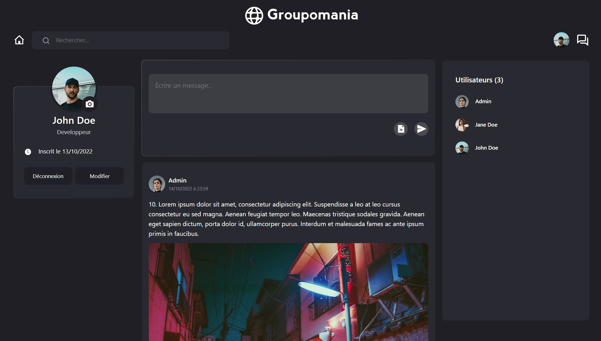

# Groupomania

Septième et dernier projet du parcours "Développeur web" chez OpenClassrooms. L'objectif est de construire un réseau social.

- [Créez un réseau social d’entreprise](./etc/groupomania_mission.pdf)

- [Cahier des charges](./etc/groupomania_cahier-des-charges.pdf)

- [Aspect visuel du site](./etc/groupomania_visuals.pdf)

 

# Lancement

## À l'attention de l'examinateur

Par convention je n'ai pas uploadé sur github les fichiers **.env** de ce projet. 

Il y en a un à la racine de chaque dossier (api/client).

Je les ai remplacés par des fichiers **sample.env** en guise d'indication.

Une fois le projet installé, avant de le lancer, il faudra renommer ces deux fichiers **sample.env** => **.env**

Les informations à compléter se trouvent dans mes livrables dans le fichier **env.txt**

## API - Backend

Prérequis  : `Node.js` et `YARN` installés sur votre ordinateur

- 1 : Installation : Depuis le dossier **api**, écrivez `yarn` dans votre environnement de développement/Terminal afin d'installer les dépendances. N'oubliez pas de renommer le fichier **sample.env** en **.env** et de remplir les variables grâce à la note **env.txt** des livrables.

- 2 : Lancement : Une fois les dépendances installées, toujours depuis le dossier **api**, lancez le script `yarn start` dans votre environnement de développement/Terminal. Votre terminal devrait indiquer que le serveur est lancé sur le port 5000 (par défaut).

## Client - Frontend

-  1 : Installation : Depuis le dossier **client**, écrivez `yarn` dans votre environnement de développement/Terminal afin d'installer les dépendances. N'oubliez pas de renommer le fichier **sample.env** en **.env** et de remplir les variables grâce à la note **env.txt** des livrables. 

- 2 : Lancement : Une fois les dépendances installées, toujours depuis le dossier **client**, lancez le script `yarn start` dans votre environnement de développement/Terminal. L'application devrait se lancer sur [localhost port 3000](http://localhost:3000/) (par défaut). 

 

# Compétences évaluées
- Réaliser un premier projet MERN stack complet
- Authentifier un utilisateur et maintenir sa session (React context, JWT)
- Implémenter un stockage de données sécurisé en utilisant une base de données (MongoDB)
- Développer l’interface d’un site web grâce à un framework front-end (React)

 

# Technologies
- MongoDB (Mongoose)
- Express (Application)
- React (front-end library/framework)
- Node.js

## API 
Bcrypt, Crypto-js, Dotenv, Express, Helmet, Jsonwebtoken, Mongoose-unique-validator, Multer, Password-validator, Validator 

## CLIENT 
Bcrypt, Crypto-js, Dotenv, Express, Helmet, Jsonwebtoken, Mongoose-unique-validator, Multer, Password-validator, Validator 

 

# Scénario
Vous êtes développeur depuis plus d'un an chez CONNECT-E, une petite agence web
regroupant une douzaine d'employés.
Votre directrice, Stéphanie, vient de signer un nouveau contrat avec Groupomania, un groupe
spécialisé dans la grande distribution, et l'un des plus Kdèles clients de l'agence.

Le projet consiste à construire un réseau social interne pour les employés de Groupomania. Le
but de cet outil est de faciliter les interactions entre collègues. Le département RH de
Groupomania a imaginé plusieurs fonctionnalités pour favoriser les échanges entre collègues. 

 

# Cahier des charges

## Identité Graphique

- Police d’écriture : tous les textes du site doivent utiliser la police Lato
- Couleurs : vous êtes libre sur les couleurs

## Technique
- Respecter les standards WCAG.
- Mise en place backend / frontend / database.
- Le projet doit être codé en JavaScript.
- Obligation d'utiliser un framework front-end (au choix).
- Choix de la base de données libre (MongoDB, mySQL...).
- Fournir un README expliquant installation/lancement du projet.

## Spécifications fonctionnelles

### Page de connexion
- Une page de connexion permettant à l’utilisateur de se connecter, ou bien de créer un compte s’il n’en possède pas.
- La connexion doit se faire à partir de deux éléments : le mail et un mot de passe. 
- Rien de plus à prévoir pour le moment.

### Détails de la fonctionnalité de connexion
- Un utilisateur doit avoir la possibilité de se déconnecter.
- La session de l’utilisateur persiste pendant qu’il est connecté.
-  Les données de connexion doivent être sécurisées.

### Page d’accueil
- La page d’accueil doit lister les posts créés par les différents utilisateurs.
- On voudra que les posts soient listés de façon antéchronologique (du plus récent au plus ancien).

### Création d’un post
- Un utilisateur doit pouvoir créer un post.
- Un post doit pouvoir contenir du texte et une image.
- Un utilisateur doit aussi pouvoir modifier et supprimer ses posts.

### Système de like
- Un utilisateur doit pouvoir liker un post, une seule fois pour chaque post.

### Rôle administrateur
- Dans le but de pouvoir faire de la modération si nécessaire, il faudra créer un utilisateur “administrateur” ; 
- Celui-ci aura les droits de modification /
suppression sur tous les posts du réseau social. 
- Il faudra donc nous communiquer les identifiants de cet administrateur.

 

